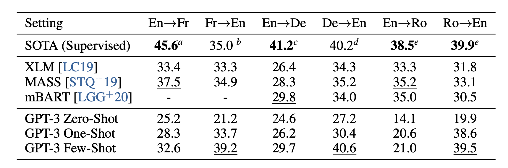
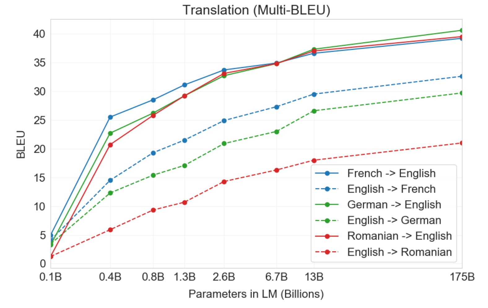

<h1> GPT-3 </h1>

<h2>Introduction</h2>	
In the past couple years, we have seen the rise of Transformer architectures in Natural Language Processing. Transformers revolutionized the speed and accuracy of machine translation systems, and allevaiated the need for
Recurrent Neural Networks and LSTMs to derive context and meaning for sequence to sequence modeling. 
Since the Attention is all you need paper was released in 2017, there have been many experimental application and fine-tuning improvements made upon the original model. The latest such improvement is the Generative Pre-trained Transformer 3, or GPT-3.
  
GPT-3 is the third generation of the autoregressive language modeling GPT-n series created by OpenAI. Its architecture is exactly the same as the previous generation, GPT-2, with the exception of using alternating dense and locally banded sparce attention patterns. OpenAI trained 8 different models with a variable number of parameters, layers, dimensions, learning rates, and batch sizes. Unlike the GPT-2 which was trained on the WebText dataset, GPT-3 was trained Common Crawl, which consists of nearly a trillion words. However, because this dataset is very large and unfiltered, various techniques had to be used to prevent data contaimination and overfitting. 

   
<h2> Novelty </h2>
Aside from the changes made above to the new model, GPT-3 is able to use one-shot and few-shot demonstrations, not only zero-shot as was done in GPT-2. To be more specific, this means that before actually testing GPT-3 on a specific task, the model can take a certain amount of examples (K) of the desired task as a form of conditioning before letting the model do testing and inference on its own. For one-shot demonstrations, K is 1, and for few-shot demonstrations, K can be anywhere between 10 and 100 demonstrations of the task. This may sounds similar to fine-tuning a model, but there is one key difference: for demonstrations, the model is <em> NOT </em> allowed to update its weights whereas for fine-tuning, the model is  <em> supposed </em> to do gradient decent in order to update its weights. This novel approach of providing demonstrations before actual testing was specifically chosen because it most accurate simulates actual human learning and behavior. Each of the different types of n-shots have their respective advantages and disadvantages shown in the table below.

   
| Testing Type | Advantages | Disadvantages |
| --- | --- | --- |
| Fine Tuning | Strong performance on a specific task | The need for an new, large dataset for the specific task |
| Few-Shot | Major reduction in the need for task specific data and examples | Potential for much worse performance than state-of-the-art fine tuned models|
| One-Shot | Most closely related to the way tasks are communicated to humans | Performs worse than Few-Shot |
| Zero-Shot | Most convenient and no need for additional data | Most challenging setting, humans cannot even perform some tasks without examples |

   
<h2> Evaluation on Various Tasks </h2>
With this new type of testing and inference method, GPT-3 was evaluated on a variety of NLP tasks that include text translation, generation, prediction, and comprehension. This fact alone — that one single model is even able to be evaluated on a range of tasks that previously had to have a single model that was explicitly trained to do a specific task — shows how powerful and exciting GPT-3 is. When describing the evaluations and accuracy for the different use cases below, I will refer to few-shot demonstrations prior to testing since it is the novel aspect in this paper.
   
<h3> Translation </h3>
One of the tasks GPT-3 was tested on was its ability to perform translation. The Common Crawl dataset OpenAI used to train their model contained English words 93% of the time and words from other languages 7% of the time. The words from the other natural languages were seamlessly blended together with the English text on a word, sentence, and document level. This allowed for the model to extract meaning and context from the foreign words, and be able to accurately translate them when asked to do so. From this translation test, GPT-3 resulted in a similar BLEU score to that of prior unsupervised NMT work. While zero-shot underperformed compared to prior works, one-shot improved the BLEU score by 4 and few-shot improved the BLEU score by 11. BLEU score improvement was especially noticed when translating phrases into English as opposed to translating sentence from English, and even outperforms the best supervised results. The table and graph below shows the comparison of BLEU scores for each of the different n-shots and other NMT models, and how BLEU score changes with model size.

  

  

   
<h3> Word Prediction and Text Generation </h3>
One of the first types of tasks GPT-3 was tested on was predicting the next word given a few sentences or a passage. A demonstration along the lines of <em> Alice was friends with Bob. Alice went to visit her friend __. → Bob </em> was given to the model as an example along with a task description. From examples like these, the largest GPT-3 model (with 175 billion parameters) outperformed the current state-of-the-art model by 20%, predicting the next word correctly 86.4% of the time. For even a model trained on task-specific data to out perform a state-of-the-art model by 20% is extraordinary. 
  
Another simliar test using GPT-3 was news article generation. The model was given a number of news articles written by humans as conditioning, and asked to generate a news article itself. Because this task is difficult to measure quantitatively, they measured the performance of the task based on whether or not a human could distinguish GPT-3 generated articles from human written one. As expected, as the size of the model increased, the ability for humans to distinguish the difference between a generated article and a human one decreased. Astoundingly though, the mean human accuracy for detecting generated articles for the largest GPT-3 model was just slightly above chance at 52%. 

  
<h3> Comprehension </h3>
One of the most extensive tasks GPT-3 was trained on was its ability to comprehend and extract meaning from text. This was tested in a varitey of ways including utilizing new words, answering questions based on prompts and facts, and reasoning. 
  
To evaluate the model's ability to utilize new words, the OpenAI team came up with some made up words and provided its definition to the model. From this information, the model was tasked to use the word in a sentence. Since there is no quantitative metric to measure how well a madeup word is used in a sentence, they used qualitative human evaluation. In most cases the generated sentences that included the made-up word seemed to be proficient at using the novel word correctly. A similar test with a quantitative metric had to do with recognizing novel patterns by using SAT analogies. The model was provided SAT style analogy questions and tasked to determine which pair of words in the answer choices had the same relationship as the words in the question. In this task, GPT-3 was correct 65.2% of the time in the few-shot setting. While this may not seem high, take into account that the average college applicat achieved was correct 57% of the time.
  
Another comprehension task GPT-3 was tested on was knowledge-based question answering. The model was given the PhysicalQA dataset which contains a set of common sense questions about how the world works. In this experiment, GPT-3 achieved an accuracy of 82.8% in the few-shot setting on the easy questions. Compared to a the previous fine-tuned state-of-the-art model RoBERTa, GPT-3 was accuracy was 3.4% higher, again showcasing its ability to outperform fine-tuned models. 
  
The last comprehension test I wanted to mention had to do with relationships between sentences and pronoun references. GPT-3 was tested to see if it could determine which subject a pronoun was referring to. This Winograd Style task is a baseline task in natural language processing, where pronoun references are very clear to humans but ambiguous in grammatical context. Fine-tuned models designed for this task achieve almost perfect accuracy now, but GPT-3 still only falls a few points below state-of-the-art models at 88.6%. A similar task has to do with natural language inference between two sentences. Here, the model was tested to understand the relationship between two sentences. Usually, this involves determining whether or not a sentence can logically follow a given sentence. This task was evaluated on SuperGLUE's RTE dataset, where GPT-3's accuracy performed just slightly above random at 56%. I mention this test to show that while GPT-3 is a very powerful model, it cannot be generalized to every aspect of natural language processing.

  
<h2> Case Study </h2>
As an experiment, I decided to test the BLEU score when translating a few phrases from Slovak, my native language, into English. Since Slovak isn't a particularly highly studied language in terms of machine translation, I thought it would be interesting to see if GPT-3 could accurately translate Slovak into English. In order to test this, I came up with a set of phrases in Slovak and their respective translations into English using Google Translate. From this set of translations, I took the Slovak phrases, fed them through the GPT-3 model completion task with a few-shot prompt, and did a BLEU score evaluation from the output of the GPT-3 model and the Google Translate reference text. One of the things I noticed is that the model sometimes generates different translated sentences for the same input. Nevertheless, the BLEU score still hovers around the same values. The prompt and results are shown below. The average BLEU score between GPT-3 and Google Translate for the ten translations was 0.7196. 
  
Prompt:
<em>
 
Slovak: Dobré ráno!
 
English: Good morning!
 
Slovak: Ako sa máš?
 
English: How are you?
 
Slovak: Odkiaľ si?
 
English: Where are you from?
 
Slovak: 
 
</em>
  

| Slovak (Input) | Reference (Google Translate) | Candidate (GPT-3) | BLEU Score |
| --- | --- | --- | --- |
| Dnes si môžeme ísť kúpiť oblečenie do nákupného centra, ale nebudeme sa tam môcť najesť | Today we can go to the mall to buy clothes, but we will not be able to eat there | Today we can go to the mall to buy clothes, but we cannot eat there | 0.6313 |
| O druhej poobede budem doma na obed | I will be home for lunch at two in the afternoon | I'll be home for lunch at 2 o'clock | 0.3553 | 
| Môžete mi poslať e-mail s dátumom a časom stretnutia? | Can you send me an email with the date and time of the meeting? | Can you send me an email with the date and time of our meeting? | 0.8555 |
| Keď sa skončí hokej, mali by sme ísť hrať hokej | When hockey is over, we should go play hockey | When hockey ends we should go play hockey | 0.5247 | 
| Kúpim chladničku za sto dolárov | I'll buy a refrigerator for a hundred dollars | I want to buy a refrigerator for $100 | 0.3457 |
| Musím sa učiť na test z biológie | I have to study for a biology test | I have to study for a biology test | 1.0 | 
| Poďme do parku a zahrajme si futbal | Let's go to the park and play football | Let's go to the park and play football | 1.0 |
| Môžeme mať na večeru kuracie mäso? | Can we have chicken for dinner? | Can we have chicken for dinner? | 1.0 |
| Tento víkend som išiel do domu svojich priateľov a hral videohry | This weekend I went to my friends' house and played video games | This weekend I went to my friends' house and played video games | 1.0 |
| Veľmi sa teším, keď ich zajtra uvidím hrať na koncerte | I'm very happy to see them play at the concert tomorrow | I'm very looking forward to seeing them play at the concert tomorrow | 0.4833 |

  
Case Study Code: 

<h2> Conclusion </h2>
From this blog, we see that GPT-3 is extremely powerful and can perform better on some NLP tasks than even the state-of-the-art fine-tuned models. GPT-3 is not trained to do anything specific task; rather, it is pretrianed on a massive dataset consisting of over a trillion words. When used for a specific task, the model is able to take zero, one, or a few demonstrations of the task depending on what type of experiment you want to conduct. This is ultimately what gives it the flexiblity to be applied to a variety of different domains within NLP. 
  
For language translation specifically, it achieved BLEU scores slightly below that of some supervised NMT models. This is incredible, given it is not fine-tuned or trained for machine tranlation. When increasing from zero-shot to one-shot to few-shot, GPT-3 performed significantly better and better in translating between languages. It performed best when translating to English because the CommonCrawl dataset used to train GPT-3 contained English words 93% of the time, and foreign words 7% of the time. In my specific case study of translating Slovak into English, the model achieved an average BLEU score of 0.7196 using a few-shot setting. 
  
In my opinion, even though GPT-3 is the latest and greatest language model to date, there is still room for improvement for these novel large-scale models. While GPT-3 proved that one pre-trained model can perform many NLP tasks and generate impressive results, it still lacks the ability to extract meaning and comprehension from text. Its synthesis techniques are gramatically sound and readable, but its contextual meaning is more often than not repetitive, incoherent, and occasionaly contradictory. There are hypotheses that bidirectional encoder models could solve these sort of comprehension issues and create another incredible model, but until we figure out a way to truly extract meaning and generate long text that gives us coherent information, I believe GPT-3 will remain the status qou for generative language models.

- Introduction
    - Novelty
        - a 175 billion parameter autoregressive language model, same model as GPT2
        - larger batch size and smaller learning rate
        - trained on Common Crawl dataset, 1 trillion words, but filtered to prevent redundancy and make sure text was human curated to prevent data contamination
        - does not overfit to common crawl (contamination is likely, but not as harmful)
        - tested using fine tuning, few shot, one shot, zero shot (amount of demonstrations used for in context analysis)
            - no gradient updates or fine tuning in shots, just demonstrations 
                - these methods best simulate actual human learning and behavior, not just training to do a specific task
                - humans have wide knowledge of language and need ot know when and how to apply it
                - few shot advantage is major reduction need for tast specific data
                - one shot is most is most sysnonymous to human like learning
                - zero shot is most convenient

- Use cases
    - a plethory of use cases
        - each use case tested on zero, one, and few shot 
        - i will focus on few shot since that is the novelty in this paper
    - completing a word, sentence or paragraph
        - 86.4% accuracy in few shot, over 18% increase in accuracy
    - translation, trained on 93% english 7% other, show graph and bleu score
        - trained by mixing many natural languages blended together on a word sentence adn document levle
        - translation into english was more accurate and stronger than other way
        - outperforms previous supervised nmt work by 5 blue 
    - news article generation
        - given human written articles and reliably generated short articles in the news genre
        - human ability to detect model generated text decreased as model size increased
    
    - learning andu utilizig new words
        - qualitative analysis shows correct or plausible usage of the word 
    - computational reasoning, reocgnizing a novel pattern
        - SAT style questions, analogies achieved 65.2% (whereas college applicants was 57% )
        - performs well on 2 to 3 digit computation, but rapidly declines with more operations

       - answering questions about some facts
        - 71.2% accuracy 
    - common sense reasoning, reading comprehension, knowledge question answering
        - 82.8%, 79.4% accuracy prior state-of-the-art 

    - which word a pronoun refers to
        - 88.6%, just a few points below state of the art
    - natural language inference, ability to understand the relationship between two sentences
        - only largest version performs better than random 56%

- Case Study
    - translate english into slovak?

    - Limitations/Future work
    - Text synthesis is gramatically sounds and readable, but is sometimes repetivite, incorehert, and contradictory
        - Could be solved by biderectinoality, re-reading 
             - Bidirectionaly models could be promising future study on large scale models like GPT3
        - Ambuiguity if few-shot actually learns new tasks at inference time, or just recognizes tasks from trainnig period
        - Expensive to perform inference on such large scale models
            - Distillation to managable size for specific tasks
- Conclusion
    - Potentially harmful
        - anything that uses text generation can be very harmful (social hacking), phishing
            - as models get better this get more dangerous
        - bais, gender discrimination, race discrimination
    - impriving pretraining sample efficiency
    
    
- still lacking in comprehension and meaning
